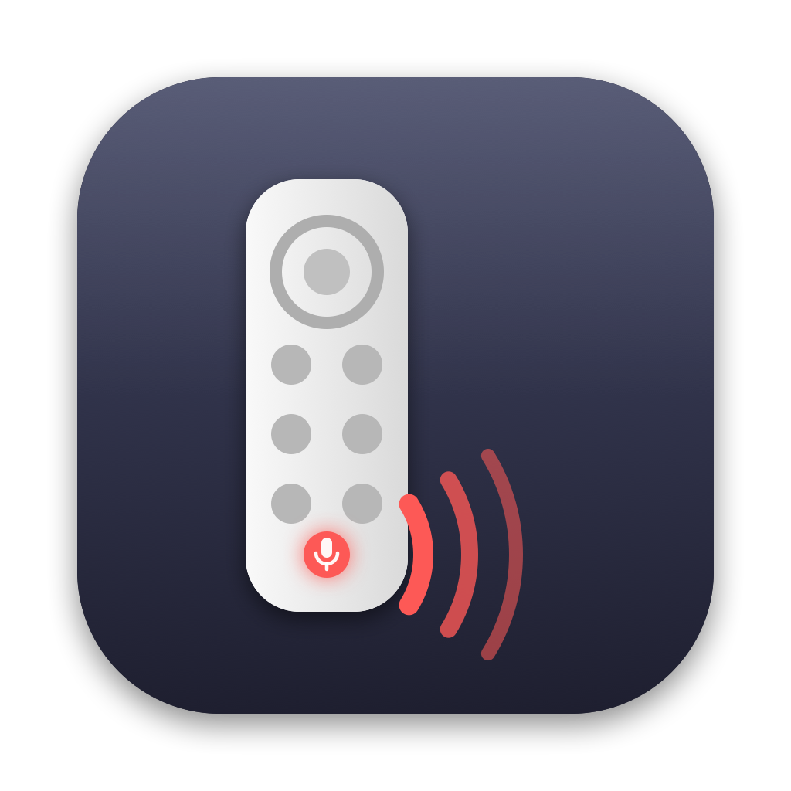

# Murmur

Whisper to your coding agent. Murmur turns an Apple TV **Siri Remote** into a walkie-talkie
push-to-talk button for terminal agents (Claude Code, Codex, Aider, …).

Hold the **Siri / mic** button, murmur your instruction, release. The transcript is pasted into
the focused terminal and Return is pressed. Speech recognition runs entirely on the Mac, so it
works offline and nothing you say leaves the machine.

<p align="center"></p>

```
hold Siri ──▶ 🎙 listening ──▶ release ──▶ transcribe (on-device) ──▶ paste ──▶ Return
                                   Menu while holding: discard the take
```

## Why a TV remote?

It's a good push-to-talk button: cheap, one-handed, Bluetooth, unmistakable in the hand, and it
pairs with a Mac as a plain HID device. What it is **not** is a microphone for the Mac — the Siri
Remote only streams voice to an Apple TV over Apple's private protocol, and it never shows up as an
audio input on macOS. Murmur treats it as the trigger and records from whichever Mac input you
choose: the built-in mic, or AirPods for whispering at your desk.

## Requirements

- macOS 26 or newer for the on-device `SpeechAnalyzer` engine (macOS 13–15 work with the older
  `SFSpeechRecognizer`, on-device where the locale supports it).
- An Apple TV Siri Remote (2nd generation or later; the black 1st-gen one also reports as HID).
- Xcode 26 or its Command Line Tools to build.

## Install

```sh
git clone https://github.com/xander-adkins/murmur.git
cd murmur
scripts/make-signing-identity.sh   # optional, once: keeps permissions across rebuilds
./install.sh                       # builds, copies Murmur.app to ~/Applications, launches
```

Then:

1. **Pair the remote**: System Settings > Bluetooth, hold `Menu` + `Volume Up` (or `Back` +
   `Volume Up`) on the remote until it appears — sometimes as "Bluetooth Device" — and Connect.
2. **Grant permissions** when prompted, or in System Settings > Privacy & Security:
   *Input Monitoring* (to read the remote), *Accessibility* (to type into the terminal),
   *Microphone*. On macOS 15 and older, *Speech Recognition* as well.
3. Focus the terminal running your agent, hold Siri, talk, release.

The menu bar icon shows the state: waveform = ready, red mic = listening, speech bubble =
transcribing, check = sent. If something is missing (no mic permission, Accessibility not
granted, nothing heard) the menu says which.

## Buttons

| Button | Action |
| --- | --- |
| Siri / Mic | hold to talk, release to send |
| Menu (while holding Siri) | discard the take, send nothing |
| Menu / Back | Esc |
| TV | Ctrl-C |
| Select, Play/Pause | Return |
| Volume Up / Down | Up / Down arrow |
| Swipe on the touch surface | arrow key in that direction (one flick, one step) |

Swipes move through an agent's menus; click the surface to choose. The remote's touch surface
never reaches the HID layer, so Murmur reads it through MultitouchSupport, the framework macOS
uses for its own trackpads. If the remote has dozed off, the first swipe wakes it and the next
one counts.

## Menu bar options

- **Send on Release** — press Return after pasting. Off: the text just lands in the prompt and
  you send it with Select.
- **Microphone** — pick the input. *System Default* follows macOS; pinning a device stops it
  wandering when headphones connect or disconnect.
- **Keep Microphone Warm** — keeps a silent input stream open between takes so AirPods stay in
  headset mode and answer instantly. Without it, AirPods need about a second after the press
  before they deliver audio, so takes under ~2 s come back empty. Costs a permanently lit mic
  indicator and call-quality playback on AirPods. Off by default.
- **Swipe to Navigate** — swipes on the touch surface press the arrow keys. On by default.
- **Options ▸ Insert by Typing** — synthesise keystrokes instead of Cmd-V; slower but leaves the
  clipboard alone. **Restore Clipboard After Paste** puts your previous clipboard back.
  **Keep Audio On Device** applies to the legacy engine only; the analyzer is always on-device.
- **Launch at Login** — registers the copy in `~/Applications`.

## Whispering

Works. In practice on an M4 Pro with AirPods: whispered sentences come back with punctuation and
capitalisation; what suffers is short technical tokens ("mic" → "Mitt"), so phrase identifiers
descriptively and let the agent resolve them. Whispers have no pitch, so the model leans on
consonants — over-articulate the ends of words rather than speaking louder. The recogniser drops
fillers ("um", "okay", restarts) on its own and there is no option to keep them.

## How fast is it?

Press to audio flowing: **~18 ms** with the mic kept warm, ~70 ms otherwise, on top of Bluetooth
button latency. The analysis session and the audio graph are pre-built between takes. AirPods add
their own ~1 s headset-mode wake-up unless kept warm; the MacBook mic has no such delay.

## Command line

```sh
./build.sh                       # release build + Murmur.app (signed with your identity if present)
MURMUR_TERMINAL=1 ./run.sh       # foreground, no menu bar, keystrokes enabled, log on stdout
scripts/test.sh                  # unit tests (swift-testing, no hardware needed)
```

Dry-run the whole pipeline without a remote — simulated 6 s press, transcript logged, nothing pasted:

```sh
MURMUR_PASSIVE=1 MURMUR_DRY_RUN=1 MURMUR_SIMULATE_PTT=6 ./run.sh
```

### Environment variables

```sh
MURMUR_TERMINAL=1            # post mapped keystrokes (the app bundle sets this)
MURMUR_SUBMIT=0              # do not press Return after pasting
MURMUR_INSERT=type           # type the transcript instead of pasting
MURMUR_RESTORE_CLIPBOARD=0   # leave the transcript on the clipboard
MURMUR_INPUT_DEVICE=AirPods  # substring of the CoreAudio input device name
MURMUR_KEEP_MIC_WARM=1       # keep the mic streaming between takes
MURMUR_SWIPE=0               # ignore the touch surface
MURMUR_LOCALE=en-GB          # recognition locale (default: system locale)
MURMUR_ENGINE=legacy         # force SFSpeechRecognizer even on macOS 26+
MURMUR_ON_DEVICE=0           # legacy engine: allow server-side recognition
MURMUR_SUBMIT_DELAY_MS=300   # gap between paste and Return
MURMUR_DRY_RUN=1             # log the transcript instead of inserting it
MURMUR_SIMULATE_PTT=6        # simulate a Siri press held for N seconds, 4 s after launch
MURMUR_STDOUT=0              # log file only
MURMUR_MENU_BAR=1            # run as the menu bar app even from the bare executable
```

Boolean variables accept `1/true/yes/on` and `0/false/no/off` (case-insensitive); anything else is
ignored so the menu setting or the built-in default applies.

HID diagnostic switches (passive, seize, raw reports) are documented in
[docs/DIAGNOSTICS.md](docs/DIAGNOSTICS.md). All are off by default.

## Troubleshooting

- **`Remote: Searching...` forever** — not paired, or asleep. Press any button, or re-pair.
- **Buttons log but nothing reaches the terminal** — Accessibility not granted. The menu bar will
  say "Grant Accessibility to paste" and the text is on your clipboard.
- **Permissions stop working after a rebuild** — the grant was bound to the old signature. Run
  `scripts/make-signing-identity.sh` once, rebuild, and re-grant one last time.
- **Short takes come back "Nothing heard" on AirPods** — headset wake-up; enable *Keep
  Microphone Warm* or hold a beat before speaking.
- **`[HID] manager open status=-536870174`** in the log is harmless if `[HID] opened remote` lines
  follow it.

Log: `~/Library/Logs/Murmur.log` (also via the menu). It records every press, the capture
device and latency, each partial hypothesis, the final transcript, and what was done with it.

## Project layout

```text
Sources/MurmurCore/   the app (library, so it can be tested)
Sources/Murmur/       three-line executable entry
Tests/MurmurTests/    swift-testing suites for the pure parts
Resources/                app icon (regenerate with scripts/make-icon.swift)
scripts/                  test runner, signing identity, icon renderer
docs/                     ARCHITECTURE.md, DIAGNOSTICS.md
```

See [docs/ARCHITECTURE.md](docs/ARCHITECTURE.md) for the data flow and module map, and
[CONTRIBUTING.md](CONTRIBUTING.md) before opening a PR.

## Privacy

Audio never leaves the Mac on macOS 26+ (and on older systems only if you turn on server-side
recognition). Nothing is sent anywhere. The app posts keystrokes only in response to your remote.
The one thing to know: the log file contains your transcripts; delete it whenever you like.

## License

MIT — see [LICENSE](LICENSE).
